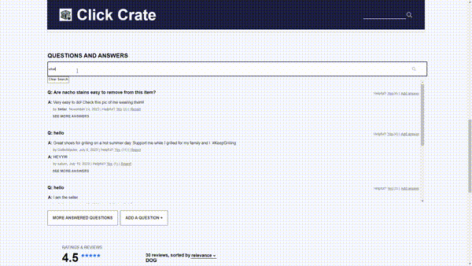

<a id='readme-top'> </a>

<br />
<div align="center">
  <a href="https://github.com/The-Fellowship-of-the-stRing/project-atelier">
    <!--  -->
  </a>
  <h3 align="center">
    Project Atelier
  </h3>
  <p align="center">
    <br />
    <a href="https://github.com/The-Fellowship-of-the-stRing/project-atelier"><strong>Explore the docs »</strong></a>
    <br />
  </p>
</div>

<details>
  <summary>Table of Contents</summary>
  <ol>
    <li>
      <a href="#about">About</a>
      <ul>
        <li>
          <a href="#built-with">Built With</a>
        </li>
      </ul>
    </li>
    <li>
      <a href="#getting-started">Getting Started</a>
      <ul>
        <li>
          <a href="#prerequisites">Prerequisites</a>
        </li>
        <li>
          <a href="#installation">Installation</a>
        </li>
      </ul>
    </li>
    <li>
      <a href="#usage">Usage</a>
    </li>
    <li>
      <a href="#roadmap">Roadmap</a>
    </li>
    <li>
      <a href="#optimizations">Optimizations</a>
    </li>
    <li>
      <a href="#contributing">Contributing</a>
    </li>
    <li>
      <a href="#contact">Contact</a>
    </li>
  </ol>
</details>

## About

<div align="center">
  
<br />
  
</div>

<br />
<p>
  Atelier is a desktop and mobile friendly app utilizing React and Express that enables users to browse through a collection of over 15 million products, add them to their outfits, read through a robust Q&A section, peruse the products ratings and reviews, and add products to their cart.
</p>

### Built With


<p align="right">
  (<a href="#readme-top">back to top</a>)
</p>

## Getting Started

<p>
    Instructions to setup Project Atelier on your local machine below.
</p>

### Prerequisites


```sh
npm install npm@latest -g
```

### Installation

1. Clone the repo
   ```sh
   git clone https://github.com/The-Fellowship-of-the-stRing/project-atelier.git
   ```
1. Install NPM packages
   ```sh
   npm install
   ```
1. Enter your port, API URL, and Github Token in `.env` file
   ```sh
    GIT_API_URL = (your database URI)
    GIT_TOKEN = (your github token)
   ```
1. Run build command.
   ```sh
   npm run build
   ```
1. Run in production environment
   ```sh
   npm run server
   ```

## Usage

Atelier is run on the designated port and opens a webpage as soon as the npm run start command is utilized. It can also be accessed utilizing localhost:PORT directly in the browser.

Run tests: ```npm run test ```

Run tests with coverage: ```npm run coverage```


<p align="right">(<a href="#readme-top">back to top</a>)</p>

<!-- ROADMAP -->

## Roadmap

- [x] Include displaying of products
- [x] Implementing sorting functions
- [x] Implement modals
- [ ] Continue styling with additonal css 

<p align="right">(<a href="#readme-top">back to top</a>)</p>

## Optimizations

 1. Reduction in Questions and Answers API calls to 1 initial call by presortings answers from API
 1. Reduced number of API calls made from infinite scrolling by throttling API requests to prevent exceeding limits 
 1. Added compression, code splitting and preload from client server to reduce webpack size and improve performance

<!-- CONTRIBUTING -->
## Contributing

Feel free to join in! Whether its fixing bugs, improving documentation, or
simply spreading the word!

<!-- CONTACT -->

## Contact

<h3 align='center'> Luke</h3>
<h4 align='center'>
  <a href="https://www.linkedin.com/in/lucas-larson-6a4bb799/">Linkedin</a> |
  <a href="https://github.com/LukeLarson2">GitHub</a>
</h4>

<h3 align='center'> Christian</h3>
<h4 align='center'>
  <a href="https://www.linkedin.com/in/christian-lee37/">Linkedin</a> |
  <a href="https://github.com/clee4037">GitHub</a>
</h4>

<h3 align='center'> Kyle</h3>
<h4 align='center'>
  <a href="https://www.linkedin.com/in/sampsonkyle/">Linkedin</a> |
  <a href="https://github.com/kssampson">GitHub</a>
</h4>

<h3 align='center'> Gordon</h3>
<h4 align='center'>
  <a href="https://www.linkedin.com/in/gordon-chiu/">Linkedin</a> |
  <a href="https://github.com/gordon1213">GitHub</a>
</h4>

<p align="right">(<a href="#readme-top">back to top</a>)</p>
